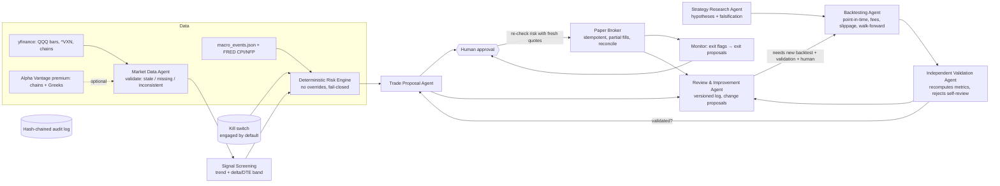

# QQQ Defined-Risk Options Platform: Assessment, Architecture & Operations

> **Status (2026-10-08):** Research and **paper trading only**. No live-order code path exists.
> No strategy has passed independent out-of-sample validation, so **no claim of profitability
> is made**. As currently specified, the rules produce **no tradable QQQ spreads** (see §7).

---

## 1. Reference material

The requested reference post (`x.com/rohonchain/status/2107469298382090680`) **could not be
retrieved**. The build environment's network policy blocks x.com, and a web search found no
mirror or quote of it. Nothing in this design is attributed to that post. The architecture
follows the specification in the task brief only.

## 2. Repository assessment

### Existing functionality (preserved, unchanged behaviour)
| Area | Module | Notes |
|---|---|---|
| Market / news / catalyst / momentum scanners | `backend/data/*`, `backend/analysis/*` | yfinance-first, graceful degradation |
| IBKR equities | `trading/ibkr_adapter.py`, `strategy_engine.py`, `trade_journal.py`, `ibkr.js` | Stocks only (`secType` hard-coded `STK`) |
| Polymarket engine | `trading/engine.py`, `paper_trader.py`, `live_trader.py`, `backtester.py` | Separate venue; untouched except security fixes |
| Equity AI | `equity/hedge_fund_bridge.py` | untouched |
| Settings | `main.py` `/api/settings*` | now auth-gated; Alpha Vantage key added |

### Gaps relative to the QQQ brief (before this work)
* No options code at all, no Greeks, no option-chain validation.
* `analysis/volatility.py::_calc_iv_percentile` ranks current IV against **historical (realised)
  vol** — it is not an IV percentile. (Left as is; the QQQ pipeline uses Cboe VXN history instead.)
* No macro event calendar; no tests anywhere in `market-catalyst-tracker`.
* Existing backtester is Polymarket-only (long-only price series).

### Security findings and what was done
| # | Finding | Severity | Fix |
|---|---|---|---|
| 1 | Every route unauthenticated, `CORS *`, app deployed publicly on Railway. Anyone could call `POST /api/ibkr/order`, enable Polymarket live mode, or overwrite API keys via `POST /api/settings`. | Critical | `require_auth` dependency on all POST/DELETE routes plus account/settings GETs. `APP_AUTH_TOKEN` Bearer token, or loopback-only when unset (never on Railway). CORS now closed by default (`CORS_ALLOW_ORIGINS`). |
| 2 | `/api/trading/live/enable` took the Polygon **private key as a URL query parameter** (ends up in access logs / browser history). | High | Now a JSON body, or read from env. Query parameters are ignored. |
| 3 | Polymarket live (real USDC) auto-enabled at boot whenever keys were present. | High | Requires explicit `POLY_LIVE_AUTOSTART=true`. |
| 4 | IBKR adapter used `verify=False` for any gateway URL. | Medium | TLS verification skipped **only** for localhost gateways. |
| 5 | Docs say gateway port 5055; code defaults to 5000. | Low | Not changed. Set `IBKR_GATEWAY_URL` explicitly. |
| — | No secrets found in code or git history; `.env` is git-ignored. | — | — |

## 3. Architecture



Module map (`backend/qqq/`):

| File | Role |
|---|---|
| `rules.py` | Frozen rule objects. The constructor rejects anything looser than the user's rules. Env vars can only tighten. `QQQ_ENV=live` raises. |
| `models.py` | Pydantic models: quotes, chains, spreads, risk decisions, proposals, orders, backtests. |
| `market_data.py` | Market Data Agent, providers, data-quality validation. Detects Alpha Vantage's artificial sample data. |
| `greeks.py`, `indicators.py` | BSM pricing/Greeks/IV; SMA, RSI, ATR, HV, trend classification. |
| `screening.py` | Builds every structurally valid vertical in the trend direction. |
| `risk_engine.py` | Deterministic entry checks (≈25) and exit flags. |
| `macro_calendar.py` | CPI/FOMC/NFP events, coverage verification, pre-event exit deadlines. |
| `proposals.py` | Thesis, invalidation, exit plan, disclaimer. |
| `paper_broker.py` | Orders, fills, ledger, reconciliation, expiration settlement. |
| `backtest/` | `data.py` (point-in-time guard, sources), `engine.py`, `metrics.py`, `walk_forward.py`. |
| `validation.py` | Independent validator. |
| `research.py`, `review.py` | Hypotheses + versioned research log; change proposals and activation gate. |
| `orchestrator.py` | Workflow, safe start/stop, scheduler, dashboard status. |
| `kill_switch.py`, `store.py`, `notifications.py`, `llm.py`, `cli.py` | Infrastructure. |

API: `/api/qqq/*` in `main.py`. UI: **QQQ Options (Paper)** tab (`frontend/static/js/qqq.js`).

## 4. Your rules → enforcement → tests

| Rule | Where enforced | Test |
|---|---|---|
| Max loss ≤ $50 **including est. fees** (open + close, both legs) | `risk_engine.max_loss_incl_fees`, `CreditSpread.max_loss` | `test_max_loss_*` |
| One open options position (working orders count) | `max_open_positions` | `test_only_one_position_or_working_order`, integration |
| No naked / undefined risk; verticals only | `defined_risk_long_wing`, `vertical_same_expiry_and_type`, `allowed_strategy` | `test_naked_*`, `test_mismatched_*` |
| No 0DTE; 14–21 DTE | `not_0dte`, `dte_window` | `test_dte_window` |
| Bull put only if above both SMA50 & SMA200; bear call only if below both; else no trade | `indicators.classify_trend`, `trend_matches_strategy` | `test_trend_classification`, `test_bull_put_requires_bullish_trend` |
| Short-leg \|Δ\| 0.10–0.15 | `short_delta_band` | `test_short_delta_band` |
| Positive net theta | `positive_net_theta` | `test_negative_theta_rejected` |
| Gamma vs premium: no invented threshold | `max_gamma_to_credit=None` → explicit UNVALIDATED warning. Research H3 can propose a ceiling, which a human sets via env after validation. | `test_gamma_threshold_*` |
| Prefer elevated IV with credible history | VXN 1-year percentile shown in the thesis; preference only, not a filter. | — |
| Exit at 50% of max profit | `exit_signals.profit_target` | `test_exit_profit_target_at_50pct` |
| Flag exit at \|Δ\| 0.30–0.35 | `delta_warning` / `delta_urgent` | `test_exit_delta_flags` |
| Don't hold into CPI/FOMC/NFP; computed deadline | `macro_calendar.exit_deadline_for`, `time_before_event_exit`, `event_deadline` | `test_*deadline*`, `test_event_too_soon_blocks_entry` |
| Kill switch, daily loss limit, reconciliation | `kill_switch.py`, `daily_loss_limit`, `broker_reconciled` | risk + integration tests |
| Default to no trading on failure | try/except → reject; cycle errors → NO_TRADE | `test_exception_during_evaluation_rejects`, `test_data_failure_means_no_trade` |
| Exits are proposals; fills not guaranteed | `ExitPlan.disclaimer`, exit proposals need approval | integration |
| AI cannot override risk | No override API. Limits are frozen and the ceilings are enforced in the constructor. `llm.py` is never imported by risk or broker code. | `test_engine_has_no_override_api`, `test_limits_are_immutable`, `test_env_cannot_loosen_limits` |
| Proposer can't approve own results | `SelfValidationError` | `test_proposer_cannot_validate_itself` |
| Review agent can't loosen limits / deploy unapproved | `ReviewAgent.propose_change/activate_change` | `test_review_agent_cannot_loosen_risk_or_self_activate` |

**Pre-event exit deadline policy:** for a release before the open (CPI and NFP at 08:30 ET), the deadline is the prior session's close minus 30 minutes. For an intraday release (FOMC statement at 14:00 ET), it is the event time minus 30 minutes. An entry is rejected if fewer than 6.5 hours remain before the deadline. **Daily loss limit:** $50, equal to one maximum loss. You didn't specify a value, so this is my default; env vars can only lower it.

## 5. Backtesting assumptions (realism)

* **No look-ahead:** all reads go through `PointInTimeView`, which raises `LookAheadError` for any bar or quote dated after the cursor. Indicators and IV percentiles only use past data.
* **Timing:** a signal on day d's EOD snapshot fills on d+1's snapshot (`fill_lag_days=1`), and only if that day's credit is at least the signalled limit. Exits fill on the snapshot where they're detected. Pre-event exits use the last snapshot before the deadline.
* **Fills:** each leg fills at mid ∓ s×half-spread (default s=0.5). The validator rejects s < 0.25.
* **Costs:** commission + regulatory estimate per contract per leg, on open and close. Assignment fee is configurable.
* **Assignment:** positions held to expiration settle at intrinsic value. Days with an ITM short leg ≤ 2 DTE are counted as assignment-risk days. Real QQQ options are American-style and physically settled; an early assignment on a $250 account would create a ~$75k share position.
* **Missing data:** a day with no chain is skipped (counted). A day where Greeks are missing gets no entry (counted). **Greeks are never back-filled from present-day data.** Synthetic BSM chains are labelled `synthetic=True` and can never be approved.
* **Walk-forward:** rolling train (365d) → test (91d), with non-overlapping test windows. The parameter grid is restricted to `delta_target`, `max_width` and `delta_exit` inside your bands; risk limits cannot be put in the grid.
* **What-if research:** `RiskLimits.what_if(...)` lets you measure, for example, a $100 cap. The proposal-path risk engine refuses these limits and the validator always rejects their results.

## 6. Independent validation policy

A backtest is APPROVED only if all of these hold:
* real historical option data (not synthetic)
* the look-ahead guard is on
* slippage ≥ 0.25
* the macro filter is on
* ≤ 20% of days are missing data
* a walk-forward was run with ≥ 30 OOS trades
* OOS expectancy > 0 and OOS profit factor > 1 after costs
* OOS max drawdown ≤ 40% of the starting balance
* OOS expectancy ≥ 50% of in-sample expectancy (overfit guard)
* all metrics recompute identically from the raw trades
* no impossible fills
* the validator is not the proposer

## 7. Live measurement and the rule conflict (decision needed)

Measured read-only through the IBKR connector on **2026-10-08** (QQQ $753.35; option quotes were DELAYED):

| Leg | Δ | Bid / Ask | θ/day |
|---|---|---|---|
| Oct-23 721P (15 DTE) | −0.133 | 2.14 / 2.17 | −0.2053 |
| Oct-23 720P | −0.128 | 2.05 / 2.08 | −0.2068 |

The narrowest possible spread (QQQ strikes are $1 apart), 721/720P, collects **$0.06 at the natural price** ($0.09 at mid). That gives **max loss $96.80** including $2.80 estimated fees. To pass the $50 cap, a $1-wide spread needs a credit of at least **$0.528**. A 0.10–0.15-delta short leg pays roughly a sixth of that. **With the rules as written, the system will propose no trades.**

The measurement also surfaced a data issue. The two legs' delayed snapshots were inconsistent: the further-OTM leg showed a larger |θ|, which made net theta negative. The positive-theta and leg-consistency checks reject such spreads.

Only you can resolve this; the software will not loosen any rule. Options include:
* raise the max-loss cap
* move the delta band closer to the money
* use a smaller-notional underlying (e.g. a Nasdaq-100 product with narrower strike spacing)
* accept that the system mostly sits in cash

Use `RiskLimits.what_if(...)` backtests to measure each alternative before changing anything.

## 8. Installation & configuration

```bash
cd market-catalyst-tracker/backend
pip install -r requirements.txt
# create backend/.env with the variables in the table below (all optional)
python -m pytest tests                     # 117 tests
uvicorn main:app --host 127.0.0.1 --port 8000
# open http://127.0.0.1:8000 → "QQQ Options (Paper)"
```

| Variable | Purpose | Default |
|---|---|---|
| `APP_AUTH_TOKEN` | Bearer token for protected routes. **Required whenever the app is reachable from another machine, a reverse proxy, or Railway.** Enter it in Settings → Dashboard Access Token. | unset → loopback only |
| `CORS_ALLOW_ORIGINS` | Comma-separated extra origins | none |
| `QQQ_ENV` | `research` or `paper` (`live` is refused) | `paper` |
| `QQQ_DB_PATH` | SQLite path for ledger, audit and research log | `backend/qqq_<env>.db` |
| `ALPHA_VANTAGE_API_KEY` | **Premium** key: real-time chains with Greeks + `HISTORICAL_OPTIONS` for backtests | unset → yfinance chains, model Greeks |
| `FRED_API_KEY` | `python -m qqq.cli macro-refresh` fills CPI/NFP dates | — |
| `QQQ_COMMISSION_PER_CONTRACT`, `QQQ_REGULATORY_FEE_PER_CONTRACT`, `QQQ_ASSIGNMENT_FEE` | Fee model (set to your broker's) | 0.65 / 0.05 / 0 |
| `QQQ_MAX_LOSS_USD`, `QQQ_DAILY_LOSS_LIMIT_USD`, `QQQ_SHORT_DELTA_MIN/MAX` | Tighten only (clamped) | your rules |
| `QQQ_MAX_GAMMA_TO_CREDIT` | Only after research H3 + validation | unset |
| `QQQ_RISK_FREE_RATE`, `QQQ_DIVIDEND_YIELD` | Inputs for model Greeks (labelled assumptions) | 0.04 / 0.006 |
| `QQQ_SCHEDULER_ENABLED`, `QQQ_SCHEDULER_INTERVAL_S` | Auto-run cycle and monitor during market hours | off / 300 |
| `NOTIFY_WEBHOOK_URL` | POST alerts (e.g. an ntfy.sh topic URL) | dashboard only |
| `QQQ_LLM_PROVIDER`, `QQQ_LLM_MODEL` (+ `ANTHROPIC_API_KEY`/`OPENAI_API_KEY`) | Optional AI drafting of hypotheses (never in the risk path) | off |
| `POLY_LIVE_AUTOSTART` | Re-enable the old Polymarket boot-time live mode | off |

**Macro calendar (required before any proposal):** edit `backend/qqq/data/macro_events.json`
from the official schedules (FOMC: federalreserve.gov; CPI/NFP: bls.gov), or run
`python -m qqq.cli macro-refresh` for CPI/NFP. Set `verified_through` for each kind. For backtests,
also add historical events and set `verified_from`. Add market holidays with their source.

**Paper workflow:**
1. Disengage the kill switch. It starts engaged and needs a reason; reconciliation must pass.
2. Click **Run screening cycle** during market hours.
3. Review the proposal: Greeks, max loss, thesis, invalidation, exit deadline.
4. **Approve (paper)**. The risk engine re-checks with fresh quotes, then the order is submitted as a limit-only DAY order to the paper broker.
5. Click **Check exits / orders**. Exit flags create exit proposals.
6. Approve the exit.

**CLI:** `python -m qqq.cli status | cycle | monitor | macro-refresh | backtest --source alphavantage|csv|synthetic --start … --end …`

## 9. Remaining blockers & unavailable APIs

1. **Rule conflict** (§7): the $50 cap vs the 0.10–0.15Δ band yields no trades on QQQ. Needs your decision.
2. **Historical option data:** backtests on real data need a **premium** Alpha Vantage key. The key behind this session's connector is not premium; it returned artificial sample rows, which the code detects and rejects. Alternatively, supply vendor CSVs (`CsvHistoricalSource`). Until then, no strategy can be validated.
3. **Macro calendar not populated:** federalreserve.gov and bls.gov were blocked from the build environment, so no dates were entered. Trading is blocked until you fill the file.
4. **Robinhood:** official documentation found covers only a **Crypto Trading API**. No official equity/options API was found; only unofficial private-endpoint wrappers. **Assume no automation**: proposals are formatted for manual entry, and no Robinhood integration was built.
5. **IBKR:** the existing adapter is stocks-only; option chains and position reconciliation were not added. IBKR's minimum-equity rules for spreads were **not verified** against official docs; check before planning a $250 account there.
6. **Public.com:** an official API exists, and this session's connector exposes spread preflight tools. The connected accounts report `optionsLevel: LEVEL_2`. Whether credit spreads need a higher level was **not verified**. No integration was built (paper-only was chosen).
7. **yfinance:** chains are delayed (~15 min) and carry no Greeks, so the code computes Greeks from each quote's own IV and labels them. It is not a production feed. Yahoo was unreachable from the build sandbox, so the live path was verified only with replayed IBKR data and fakes.
8. **Intraday precision:** the backtester is end-of-day. Intraday stops, pre-event intraday exits and pin risk are approximated.
9. **Single process:** SQLite and the in-process scheduler assume one uvicorn worker (the current Railway setup).
